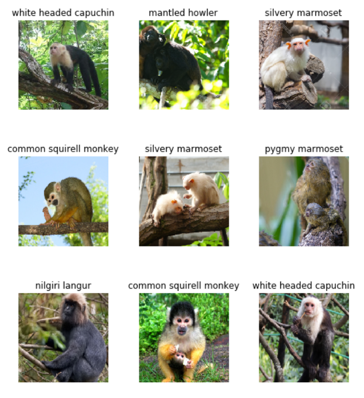
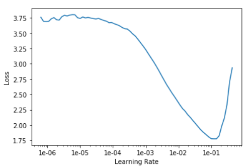
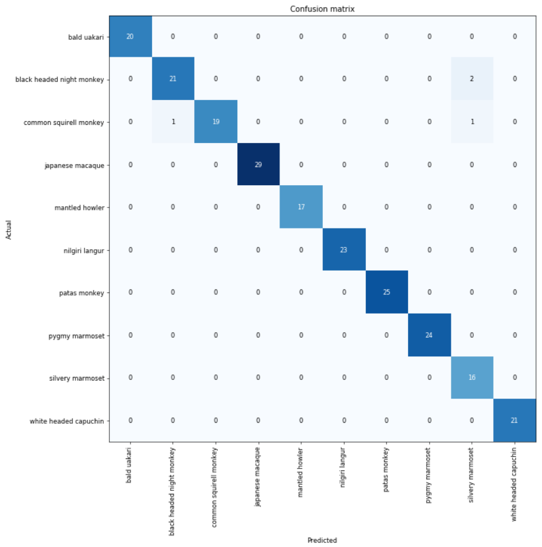
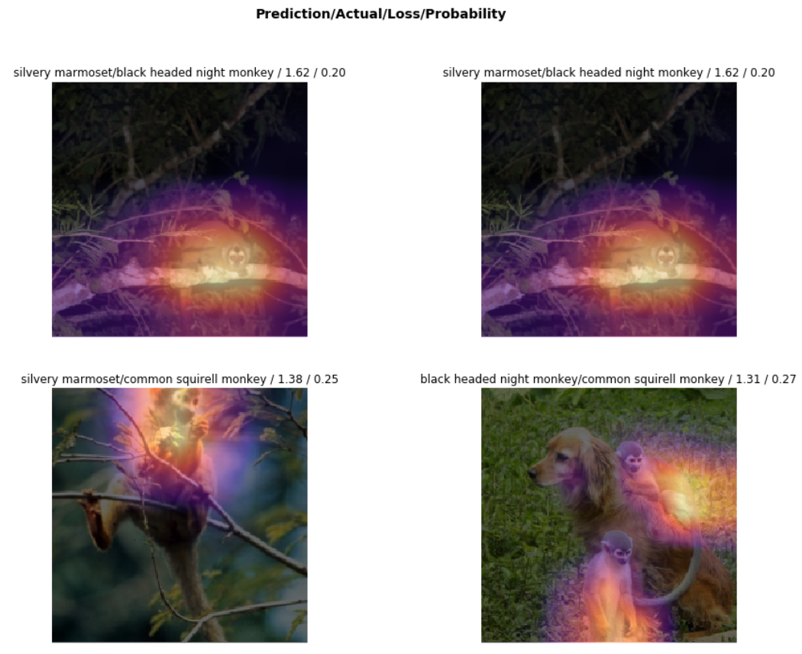
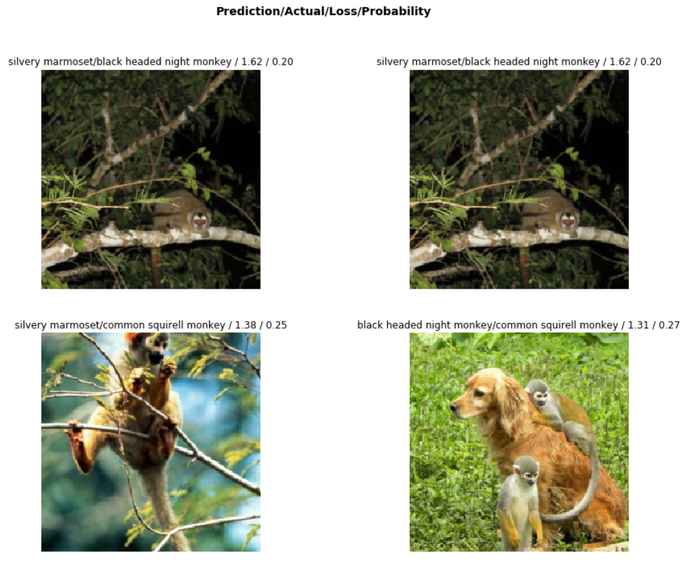
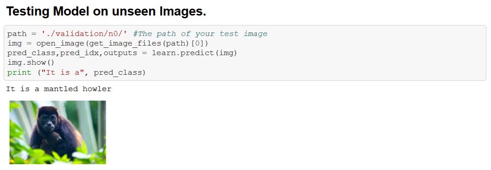

# Deep-Learning-Image-Classification
Deep Learning Image Classification

A Deep Learning Classifier to classify various species of Monkeys.

## Some species of monkey in dataset.

## Learning Rate vs Loss

## Confusion Matrix : The diagonal elements represent the number of images for which the predicted label is equal to the true label, while off-diagonal elements are those that are mislabeled by the classifier.

## Images with top losses; in other words, the images that the model was most confused about. A high loss implies high confidence about the wrong answer.

## Testing Model on unseen Images.

### Similiar project link https://github.com/abhisheksaxena1998/Emotion-detection-from-video

